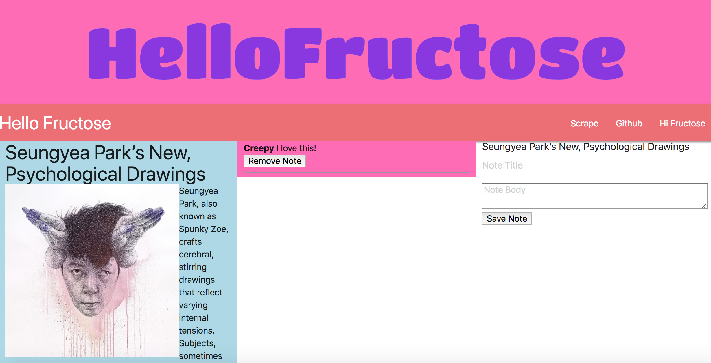

# fructoseNotes
Scrape hifructose and add notes taking ability. This MVC stack is built on a handelbars template and uses the following techologies: Axios, Materilize, GoogleFonts, Mongoose, Cheerio, and (our lifeblood) EXPRESS!! 

## The Scrape
Scrape when you're ready for some new art to check out. I make use of the 'unique: true' key pair to avoid duplicate entries.  
## Notes
Notes are stored in a seperate table. An array holds their ids for "populating" the page.  

## Page Actions
* Scrape
* Add Notes
* Delete an Article
* Delete a Note
* link to github
* link to HiFructose homepage
